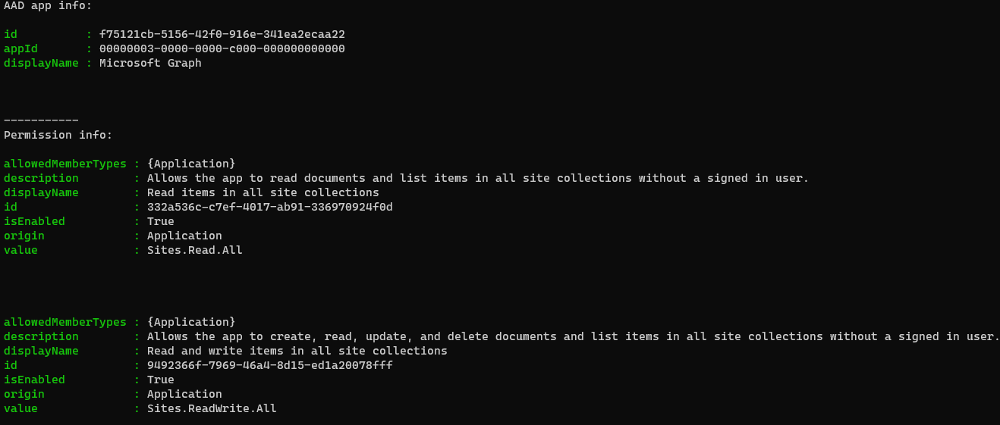

# Get Azure AD app permission info (delegated or application)

## Summary

When creating or interpreting an Azure AD (AAD) app manifest or even to get existing permissions for a Microsoft app, you would like to have info about them, such as the resource id or if the permission requires admin consent. This script can be useful, because if you have permission name (or a piece of it) and the permission type (user or application context), it's enough to get the info you want!



By default, the script has only registered Microsoft Graph and SharePoint Online Microsoft AAD apps (with their respective appId property). Feel free to add any other API listed [here](https://docs.microsoft.com/troubleshoot/azure/active-directory/verify-first-party-apps-sign-in#application-ids-for-commonly-used-microsoft-applications) in the `AadApis` class!


# [CLI for Microsoft 365 using PowerShell](#tab/cli-m365-ps)

```powershell

# User Input
$api = "Microsoft Graph" # Or "SharePoint"
$permission = "Sites.Read.All" # Can be "Read" if seeking more permissions

# Connect to Microsoft 365
if ($(m365 status) -match "Logged Out") {
  m365 login
}

# Configure the CLI to output as JSON on each execution
$m365output = m365 cli config get --key output
if ($m365output -notmatch "json") {
    m365 cli config set --key output --value json
}

# Get CLI commands JSON output converted as objects
function Get-CLIValue {
    [cmdletbinding()]
    param(
        [parameter(Mandatory = $true, ValueFromPipeline = $true)]
        $input
    )
    
    $output = $input | ConvertFrom-Json
    if ($null -ne $output.error) {
        throw $output.error
    }
    return $output
}

# Dedicated class to store Azure AD (AAD) Enterprise Microsoft Apps as valid param inputs 
class AadApis : System.Management.Automation.IValidateSetValuesGenerator {
    [String[]] GetValidValues() {
        $Global:aadApis = @{
            "SharePoint" = "00000003-0000-0ff1-ce00-000000000000"
            "Microsoft Graph" = "00000003-0000-0000-c000-000000000000"
        }

        return ($Global:aadApis).Keys
    }
}

# Method to get delegated or application permissions from a registered AAD MS App, based on name
function Get-AADPermission {
    [cmdletbinding()]
    param(
        [parameter(Mandatory)]
        [ValidateSet([AadApis], IgnoreCase = $false)]
        $ApiName,
        [parameter(Mandatory)]
        $PermissionName,
        [parameter(Mandatory = $false)]
        [Switch]$Delegated,
        [parameter(Mandatory = $false)]
        [Switch]$Application
    )

    try {
        $sp = m365 aad sp get --appId ($Global:aadApis)[$ApiName] | Get-CLIValue

        if ($Delegated) {
            $permissionsInfo = $sp.oauth2PermissionScopes | Where-Object { $_.value -match $PermissionName }
        }
        elseif ($Application) {
            $permissionsInfo = $sp.appRoles | Where-Object { $_.value -match $PermissionName }
        }
        else {
            throw "Please define if seeked permission is a delegated (-Scope) or an application (-Role) one"
        }

        if ($permissionsInfo) {
            Write-Host "AAD app info:"
            Write-Host ($sp | Select-Object id, appId, displayName | Format-List | Out-String)
            Write-Host "-----------"
            Write-Host "Permissions info:"

            foreach ($perm in $permissionsInfo) {
                Write-Host ($perm | Format-List | Out-String)
            }
        }
        else {
            $permissionType = (&{If($Delegated -eq $true) {"Delegated"} Else {"Application"}})
            
            Write-Warning "No $($permissionType) permission named [$($PermissionName)] found for $($ApiName) App"
        }
    }
    catch {
        Write-Error $_.Exception
    }
}

# Run the command
Get-AADPermission -ApiName $api -PermissionName $permission -Application

```
[!INCLUDE [More about CLI for Microsoft 365](../../docfx/includes/MORE-CLIM365.md)]


# [Microsoft Graph PowerShell](#tab/graphps)

```powershell

# User Input
$api = "Microsoft Graph" # Or "SharePoint"
$permission = "Sites.Read.All" # Can be "Read" if seeking more permissions

# Connect to Microsoft 365
# Requesting permission to read Azure AD (AAD) Apps
Connect-MgGraph -Scopes "Application.Read.All"

# Dedicated class to store AAD Enterprise Microsoft Apps as valid param inputs 
class AadApis : System.Management.Automation.IValidateSetValuesGenerator {
    [String[]] GetValidValues() {
        $Global:aadApis = @{
            "SharePoint" = "00000003-0000-0ff1-ce00-000000000000"
            "Microsoft Graph" = "00000003-0000-0000-c000-000000000000"
        }

        return ($Global:aadApis).Keys
    }
}

# Method to get delegated or application permissions from a registered AAD MS App, based on name
function Get-AADPermission {
    [cmdletbinding()]
    param(
        [parameter(Mandatory)]
        [ValidateSet([AadApis], IgnoreCase = $false)]
        $ApiName,
        [parameter(Mandatory)]
        $PermissionName,
        [parameter(Mandatory = $false)]
        [Switch]$Delegated,
        [parameter(Mandatory = $false)]
        [Switch]$Application
    )

    try {
        $sp = Get-MgServicePrincipal -Filter "AppId eq '$(($Global:aadApis)[$ApiName])'"

        if ($Delegated) {
            $permissionsInfo = $sp.Oauth2PermissionScopes | Where-Object { $_.value -match $PermissionName }
        }
        elseif ($Application) {
            $permissionsInfo = $sp.AppRoles | Where-Object { $_.value -match $PermissionName }
        }
        else {
            throw "Please define if seeked permission is a delegated (-Scope) or an application (-Role) one"
        }

        if ($permissionsInfo) {
            Write-Host "AAD app info:"
            Write-Host ($sp | Select-Object id, appId, displayName | Format-List | Out-String)
            Write-Host "-----------"
            Write-Host "Permissions info:"
            
            foreach ($perm in $permissionsInfo) {
                Write-Host ($perm | Format-List | Out-String)
            }
        }
        else {
            $permissionType = (&{If($Delegated -eq $true) {"Delegated"} Else {"Application"}})
            
            Write-Warning "No $($permissionType) permission named [$($PermissionName)] found for $($ApiName) App"
        }
    }
    catch {
        Write-Error $_.Exception
    }
}

# Run the command
Get-AADPermission -ApiName $api -PermissionName $permission -Application

```
[!INCLUDE [More about Microsoft Graph PowerShell SDK](../../docfx/includes/MORE-GRAPHSDK.md)]
***


## Contributors

| Author(s)                                            |
|------------------------------------------------------|
| [Michaël Maillot](https://github.com/michaelmaillot) |


[!INCLUDE [DISCLAIMER](../../docfx/includes/DISCLAIMER.md)]
