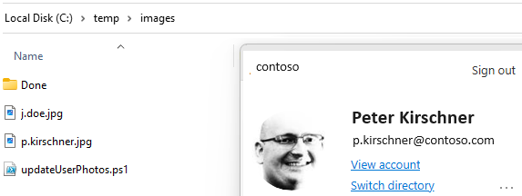

# Add or Update User Photo

## Summary

The script streamlines the process of updating user photos by automating the retrieval and application of images stored locally. It ensures efficient handling of both successful updates and errors, providing an organized approach to managing user photos within Microsoft 365.



## Limitations

Maximum FileSize is 4MB (REST request limit is 4MB)

# [Microsoft Graph PowerShell](#tab/graphps)

Config parameter:
```$imageSourcePath```
```$upnDomain```
name of the image file has to be the username without the domain

|Name     | Filename | UPN |
|---------|----------|-----|
|John Doe |j.doe.jpg | p.Doe@contoso.com |

```powershell

# Check if Microsoft.Graph module is already installed, if not install it
if (-not(Get-Module Microsoft.Graph)) {
    Install-Module -Name Microsoft.Graph
}

$upnDomain="@contoso.com"
$imageSourcePath="c:\temp\images\"
$completeFolder="Done"
$errorFolder="Error"

Connect-MgGraph -Scopes "User.ReadWrite.All"

if(-not(Test-Path $imageSourcePath)){
 Write-Host "Image Source Path not exists, Please Check the ConfigValue imageSourcePath"
 exit(2)
}
$imageFiles=Get-ChildItem -Path $imageSourcePath -Filter *.jpg

Import-Module Microsoft.Graph.Users
foreach($imageFile in $imageFiles){
    $username=$imageFile.Name.Substring(0,$imageFile.Name.lastIndexof('.'));
    $content=Get-Content $imageFile.VersionInfo.FileName;
    $upn ="$username$upnDomain"
        try{
        Set-MgUserPhotoContent -UserId $upn -BodyParameter $content

        $completePath = Join-Path -Path $imageSourcePath -ChildPath $completeFolder
            if(-not(Test-Path $completePath)){
            New-Item -ItemType Directory  -Path $completePath
            }
        Move-Item -Path $imageFile.VersionInfo.FileName -Destination $completePath
        }catch{
        Write-Host $error
        $errorPath = Join-Path -Path $imageSourcePath -ChildPath $errorFolder
            if(-not(Test-Path $errorPath)){
            New-Item -ItemType Directory  -Path $errorPath
            }
        $error|Set-Content -Path "$errorPath\$username.error.txt"
        Move-Item -Path $imageFile.VersionInfo.FileName -Destination $errorPath
        }
}

```

[!INCLUDE [More about Microsoft Graph PowerShell SDK](../../docfx/includes/MORE-GRAPHSDK.md)]

## Contributors

| Author(s) |
|-----------|
| [Peter Paul Kirschner](https://github.com/petkir) |

[!INCLUDE [DISCLAIMER](../../docfx/includes/DISCLAIMER.md)]

