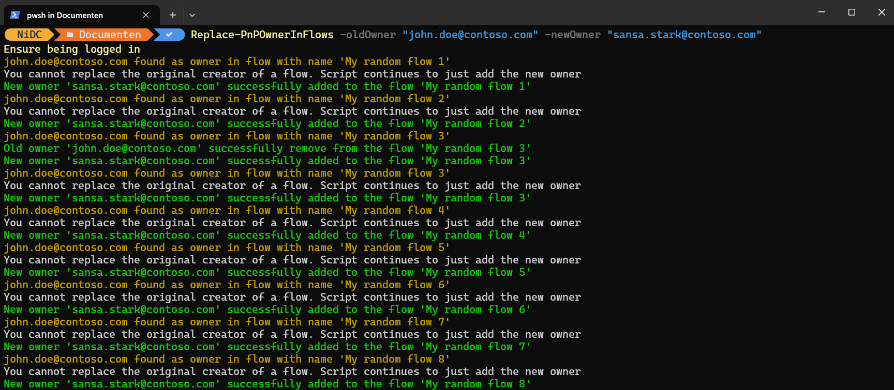

# Replace owner on every flow in a tenant

## Summary

The script will go through all the Power Automate flows present in the default environment or a specfic environment if provided and replace the owner on every Power Automate flow its owner of.



## Implementation
Save this script to a PSM1 module file, like `replace-flowOnwers.psm1`. Then import the module file with Import-Module:
```powershell

Import-Module replace-flowOnwers.psm1 -Verbose

```
The -Verbose switch lists the functions that are imported.

Once the module is imported the function `Replace-PnPOwnerInFlows` will be loaded and ready to use.

[!INCLUDE [Delete Warning](../../docfx/includes/DELETE-WARN.md)]

# [CLI for Microsoft 365](#tab/cli-m365-ps)
```powershell
Function Replace-PnPOwnerInFlows {
<#
.SYNOPSIS
Script to replace an owner in all its flows

.Description
this script looks for all flows owned by a specified user and replaces them with a new owner. You can indicate whether this should happen in a certain environment. If no value is given for the environment parameter, the default environment is used. Please note that you cannot remove the original creator of a flow. In that case this script will only add the new owner

.PARAMETER oldOwner
The UPN of the old owner

.PARAMETER newOwner
The UPN of the new owner

.Parameter environment
The name of the environment. The default environment will be used if not provided

.Example 
Replace-PnPOwnerInFlows -oldOwner "john.doe@contoso.com" -newOwner "sansa.stark@contoso.com"

.Example 
Replace-PnPOwnerInFlows -oldOwner "john.doe@contoso.com" -newOwner "sansa.stark@contoso.com" -environment "Default-0e943d12-6a07-4544-adaf-1e7c9ad82fa0"

#>    
    [CmdletBinding()]
    param (
        [Parameter(Mandatory = $true)]
        $oldOwner,
        [Parameter(Mandatory = $true)]
        $newOwner,
        [Parameter(Mandatory = $false)]
        $environment
    )
    
    begin {
        #Log in to Microsoft 365
        Write-host "Ensure being logged in" -f Yellow
        $m365Status = m365 status
        if ($m365Status -match "Logged Out") {
           m365 login
        }
    }
    
    process {
        $oldOwnerAsUser = m365 aad user get --userName $oldOwner | ConvertFrom-Json
        $oldOwnerPrincipalId = $oldOwnerAsUser.id

        if(!$environment){
            $defaultEnvironment = m365 pp environment get | ConvertFrom-Json
            $environment = $defaultEnvironment.name
        }

        $flows = m365 flow list --environmentName $environment | ConvertFrom-Json

        foreach($flow in $flows) {
             $owners = m365 flow owner list --environmentName $environment --flowName $($flow.name) | ConvertFrom-Json
             foreach($owner in $owners){
                if($owner.properties.principal.id -eq $oldOwnerPrincipalId){
                    Write-Host "$oldOwner found as owner in flow with name '$($flow.displayName)'" -f DarkYellow
                    if($owner.properties.roleName -eq "Owner"){
                        Write-Host "You cannot replace the original creator of a flow. Script continues to just add the new owner" -f Gray
                    } else {
                        m365 flow owner remove --userId $oldOwnerPrincipalId --environmentName $environment --flowName $($flow.name) --confirm
                        Write-Host "Old owner '$oldOwner' successfully remove from the flow '$($flow.displayName)'" -f Green
                    }

                    m365 flow owner ensure --userName $newOwner --environmentName $environment --flowName $($flow.name) --roleName "CanEdit"
                    
                    Write-Host "New owner '$newOwner' successfully added to the flow '$($flow.displayName)'" -f Green
                }
             }
        }
    }
    
    end {
        
    }
}
```
[!INCLUDE [More about CLI for Microsoft 365](../../docfx/includes/MORE-CLIM365.md)]

***

## Contributors

| Author(s) |
|-----------|
| [Nico De Cleyre](https://www.nicodecleyre.com)|

[!INCLUDE [DISCLAIMER](../../docfx/includes/DISCLAIMER.md)]
