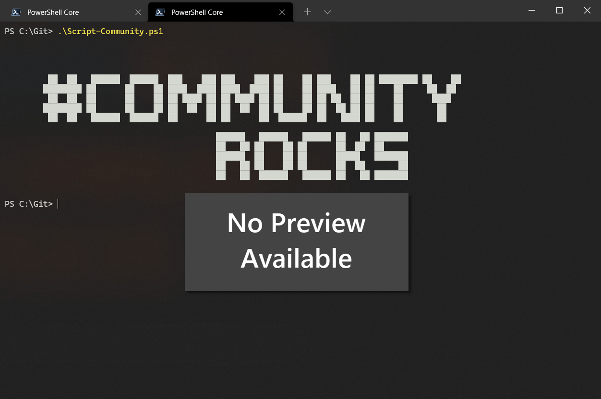

# Add multiple folders in libraries using a csv file

## Summary

Below is an example of the format needed for your .csv file:

| libName | folderName |
| --------| ---------- |
| Customers | Contracts |
| Support | Roadmaps |
| Support | Analysis |
 
> [!important]
> Make sure your target libraries contained in the file do exist in SharePoint Online.
 

 
# [CLI for Microsoft 365](#tab/cli-m365-ps)
```powershell
<#
.SYNOPSIS
    Create multiple folders in different libraries.
.DESCRIPTION
    Create multiple folders in different libraries in a specific site using a .csv file.
.EXAMPLE
    PS C:\> Add-FoldersToMultipleLibraries -siteUrl "https://contoso.sharepoint.com/sites/Marketing" -filePathToImport "C:\myCSVFile.csv"
    This script will create the folders (not nested) into the libraries provided in the .csv file.
.INPUTS
    Inputs (if any)
.OUTPUTS
    Output (if any)
.NOTES
    Your .csv file MUST contain headers called libName and folderName. If you change those headers then make sure to amend the script.
    Also make sure that your libraries ALREADY exist.
#>
function Add-FoldersToMultipleLibraries {
    [CmdletBinding()]
    param (
        [Parameter(Mandatory = $true, HelpMessage = "Full URL of the target SharePoint Online site")]
        [string]$site,
        [Parameter(Mandatory = $true, HelpMessage = "Full path of your .csv file")]
        [string]$filePathToImport
    )
    
    #Create the folders
    $csvFile = Import-Csv -Path $filePathToImport
    
    foreach($row in $csvFile){
        Write-Host "Creating:" $row.folderName -f Yellow
        m365 spo folder add --webUrl $site --parentFolderUrl $($row.libName) --name $($row.folderName)
    }
}
```
***


Below is an example of the format needed for your .csv file:

| libName | folderName | site |
| --------| ---------- | ---- |
| Customers | Contracts | https://contoso.sharepoint.com/sites/site1 |
| Support | Roadmaps |  https://contoso.sharepoint.com/sites/site2 |
| Support | Analysis | https://contoso.sharepoint.com/sites/site2 |

> [!important]
> Make sure your target libraries & sites contained in the file do exist in SharePoint Online.
 
# [CLI for Microsoft 365](#tab/cli-m365-ps2)
```powershell
<#
.SYNOPSIS
    Create multiple folders in different libraries and in different sites.
.DESCRIPTION
    Create multiple folders in different libraries and in different SharePoint sites using a .csv file.
.EXAMPLE
    PS C:\> Add-FoldersToMultipleLibrariesInMultipleSites -filePathToImport 'C:\myCSVFile.csv'
    This script will create the folders (not nested) into the libraries and sites provided in the .csv file.
.INPUTS
    Inputs (if any)
.OUTPUTS
    Output (if any)
.NOTES
    Your .csv file MUST contain headers called libName, folderName, and site. If you change those headers then make sure to amend the script.
    Also make sure that your libraries & sites ALREADY exist.
#>
function Add-FoldersToMultipleLibrariesInMultipleSites {
    [CmdletBinding()]
    param (
        [Parameter(Mandatory = $true, HelpMessage = "Full path of your .csv file")]
        [string]$filePathToImport
    )
    
    #Create the folders
    $csvFile = Import-Csv -Path $filePathToImport
    
    foreach ($row in $csvFile) {
        Write-Host "Creating:" $row.folderName -f Yellow
        m365 spo folder add --webUrl $($row.site) --parentFolderUrl $($row.libName) --name $($row.folderName)
    }
}
```
[!INCLUDE [More about CLI for Microsoft 365](../../docfx/includes/MORE-CLIM365.md)]
***

## Source Credit

Sample first appeared on [Add multiple folders in libraries using a csv file | CLI for Microsoft 365](https://pnp.github.io/cli-microsoft365/sample-scripts/spo/add-multiple-folders-in-libraries-using-csv-file/)

## Contributors

| Author(s) |
|-----------|
| Veronique Lengelle |


[!INCLUDE [DISCLAIMER](../../docfx/includes/DISCLAIMER.md)]
