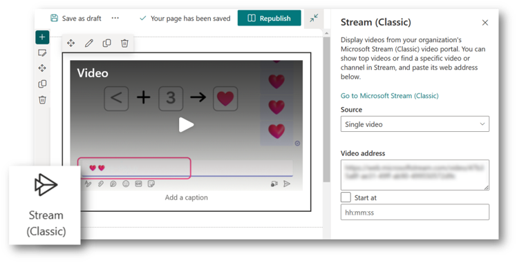
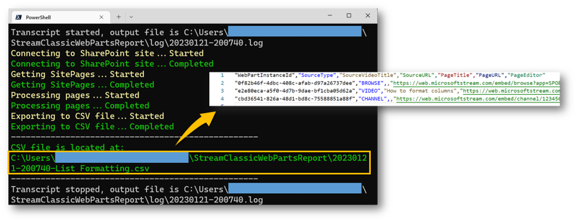

# Export of Stream (Classic) Web Parts and pages that use them

## Summary

Microsoft Stream (Classic) is scheduled to be retired. More information on this can be found at the following link.

[Migration Overview - Stream (Classic) to Stream (on SharePoint)](https://learn.microsoft.com/stream/streamnew/stream-classic-to-new-migration-overview)

In addition to migrating the videos, this retirement may also involve replacing Stream (Classic) Web Parts embedded within SharePoint pages.



This sample script helps you understand how many Stream (Classic) Web Parts are being used by your site by outputting a CSV file of the Stream (Classic) Web Parts and the pages that use them. The CSV file is created in the StreamClassicWebPartsReport folder in My Documents.



The following is a description of the CSV columns and a sample CSV output.

| Column Name       | Description                                                                                                                                                               |
| ----------------- | ------------------------------------------------------------------------------------------------------------------------------------------------------------------------- |
| WebPartInstanceId | The value of this column is set to the Instance Id of the Stream (Classic) Web Part.                                                                                      |
| SourceType        | The value of this column is set to the Source Type of the Stream (Classic) Web Part and has the following 3 values.<ul><li>BROWSE</li><li>VIDEO</li><li>CHANNEL</li></ul> |
| SourceVideoTitle  | The value of this column is set to the title of the video set in the Stream (Classic) Web Part. However, it is set only when SourceType is "VIDEO".                       |
| SourceURL         | The value of this column is set to the URL of the source set for the Stream (Classic) Web Part.                                                                           |
| PageTitle         | The value of this column is set to the title of the page in which the Stream (Classic) Web Part is embedded.                                                              |
| PageURL           | The value of this column is set to the URL of the page where the Stream (Classic) Web Part is embedded.                                                                   |
| PageEditor        | The value of this column is set to the name of the editor of the page in which the Stream (Classic) Web Part is embedded.                                                 |

```csv
"WebPartInstanceId","SourceType","SourceVideoTitle","SourceURL","PageTitle","PageURL","PageEditor"
"0f82b46f-4dbc-408c-afab-d97a26737dee","BROWSE",,"https://web.microsoftstream.com/embed/browse?app=SPO&displayMode=buttons&showDescription=true&sort=trending","Home.aspx","https://contoso.sharepoint.com/sites/ListFormatting/SitePages/Home.aspx","Tetsuya Kawahara"
"e2e80eca-a5f0-4d7b-9dae-bf1cba05d62a","VIDEO","How to format columns","https://web.microsoftstream.com/embed/video/1234567-abcd-5678-abcd-012345abcde?app=SPO&autoplay=false&preload=none","AboutListFormatting.aspx","https://contoso.sharepoint.com/sites/ListFormatting/SitePages/AboutListFormatting.aspx","Adele Vance"
"cbd36541-826a-48d1-bd8c-75588851a88f","CHANNEL",,"https://web.microsoftstream.com/embed/channel/1234567-abcd-5678-abcd-012345abcde?app=SPO&sort=trending","ColumnFormatting.aspx","https://contoso.sharepoint.com/sites/ListFormatting/SitePages/ColumnFormatting.aspx","Alex Wilber"
```

# [PnP PowerShell](#tab/pnpps)

```powershell
# Usage example1 : If you do not want to open the folder with the CSV file after the script is completed.
# .\spo-export-stream-classic-webparts.ps1 -siteUrl "https://contoso.sharepoint.com/PnPScriptSamples"
#
# Usage example2 : If you want to open the folder with the CSV file after the script is completed.
# .\spo-export-stream-classic-webparts.ps1 -siteUrl "https://contoso.sharepoint.com/PnPScriptSamples" -openFolder

[CmdletBinding()]
param(
    [parameter(Mandatory = $true, HelpMessage = "URL of the SharePoint site, e.g.https://contoso.sharepoint.com/PnPScriptSamples")]
    [string]$siteUrl,
    [parameter(Mandatory = $false, HelpMessage = "If true, open the folder containing the CSV file after the script completes. Default is false")]
    [switch]$openFolder = $false
)

$csvFolderPath = "$([Environment]::GetFolderPath("MyDocuments"))\StreamClassicWebPartsReport"
$logFolderPath = "$([Environment]::GetFolderPath("MyDocuments"))\StreamClassicWebPartsReport\log"

# Create the log and csv folder if they don't exist
if (!(Test-Path $csvFolderPath)) { New-Item -ItemType Directory -Path $csvFolderPath }
if (!(Test-Path $logFolderPath)) { New-Item -ItemType Directory -Path $logFolderPath }

# Start logging
$timeStamp = (Get-Date).ToString("yyyyMMdd-HHmmss")
Start-Transcript -Path "$logFolderPath\$($timeStamp).log"

# Connect to SharePoint site
try {
    Write-Host "Connecting to SharePoint site...Started" -ForegroundColor Yellow
    Connect-PnPOnline -Url $siteUrl -Interactive -ErrorAction Stop
    Write-Host "Connecting to SharePoint site...Completed" -ForegroundColor Green
}
catch {
    Write-Error "Error connecting to $($siteUrl). Error message: $_.Exception.Message"
    Stop-Transcript
    return
}

try {
    # Get SitePages
    Write-Host "Getting SitePages...Started" -ForegroundColor Yellow
    $items = Get-PnPListItem -List "SitePages" -ErrorAction Stop | Where-Object { $_["FileLeafRef"] -like "*.aspx" }
    $itemCount = $items.count
    Write-Host "Getting SitePages...Completed" -ForegroundColor Green

    # Get web parts in each page
    $streamWebParts = @()
    $counter = 0
    $uri = New-Object System.Uri($siteUrl)
    $rootUrl = "$($uri.Scheme)://$($uri.Host)"
    Write-Host "Processing pages...Started" -ForegroundColor Yellow
    foreach ($item in $items) {
        try {
            $counter++
            Write-Progress -Activity "Processing pages" -Status "$counter/$itemCount" -PercentComplete (($counter / $itemCount) * 100)

            $page = Get-PnPPage -Identity $item["FileLeafRef"] -ErrorAction Stop
            foreach ($control in ($page.Controls | Where-Object { $_.WebPartId -eq "275c0095-a77e-4f6d-a2a0-6a7626911518" })) {
                $controlProperties = ConvertFrom-Json $control.PropertiesJson -ErrorAction Stop
                $streamWebPart = [PSCustomObject]@{
                    WebPartInstanceId = $control.InstanceId
                    SourceType        = $controlProperties.sourceType
                    SourceVideoTitle  = $controlProperties.videoTitle
                    SourceURL         = [regex]::Matches($controlProperties.embedCode, 'src="(.+?)"')[0].Value -replace 'src="', '' -replace '"', ''
                    PageTitle         = $item["FileLeafRef"]
                    PageURL           = "$($rootUrl)$($item["FileRef"])"
                    PageEditor        = $item["Editor"].lookupValue
                }
                $streamWebParts += $streamWebPart
            }
        }
        catch {
            Write-Error "Error processing page $($item["FileLeafRef"]). Error message: $_.Exception.Message"
        }
    }
    Write-Host "Processing pages...Completed" -ForegroundColor Green

    # Export web parts to CSV
    try {
        $site = Get-PnPWeb
        $csvFilePath = "$csvFolderPath\$($timeStamp)-$($site.Title).csv"

        Write-Host "Exporting to CSV file...Started" -ForegroundColor Yellow
        $streamWebParts | Export-Csv $csvFilePath -ErrorAction Stop
        Write-Host "Exporting to CSV file...Completed" -ForegroundColor Green

        Write-Host "-".PadRight(50, "-")
        Write-Host "CSV file is located at:" -ForegroundColor Green
        Write-Host $csvFilePath -ForegroundColor Green
        Write-Host "-".PadRight(50, "-")

        if ($openFolder) {
            Invoke-Item -Path $csvFolderPath
        }
    }
    catch {
        Write-Error "Error exporting stream web parts to $($csvFilePath). Error message: $_.Exception.Message"
    }
}
catch {
    Write-Error "Error getting SitePages. Error message: $_.Exception.Message"
    return
}
finally {
    Disconnect-PnPOnline
    Stop-Transcript
}
```
[!INCLUDE [More about PnP PowerShell](../../docfx/includes/MORE-PNPPS.md)]
***

## Contributors

| Author(s)        |
|------------------|
| Tetsuya Kawahara |

[!INCLUDE [DISCLAIMER](../../docfx/includes/DISCLAIMER.md)]
