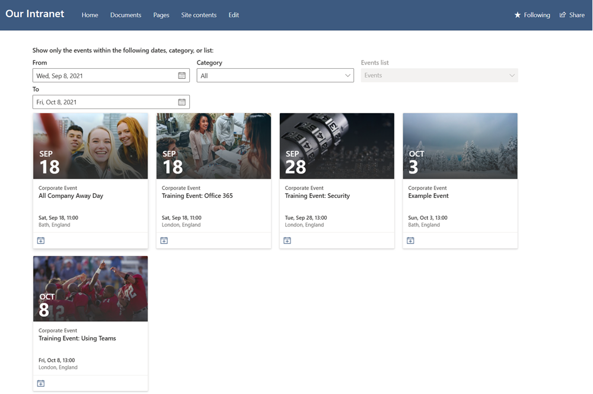

# Generate Demo Events for SharePoint Events List

## Summary

This sample script generates demo events for the SharePoint Events List within a modern site. This uses a CSV to load sample events that includes, titles, descriptions, start, end times, category. The script will use the current date and add days to the events from the CSV file to create example events in the future relative to the current date.

This scenario shows how to bulk add events and could be modified to bulk load events into the SharePoint Events List.

> [!Note]
> The script does not include the imagery shown in the screenshot, I have update stock images as its very quick to do.
> In addition, the location does not resolve the longitude and latitude coordinates.




# [PnP PowerShell](#tab/pnpps)

```powershell
Connect-PnPOnline https://contoso.sharepoint.com/sites/demo -Interactive

# Load Data from CSV File
$eventsToAdd = Import-CSV events.csv

# Each time you run the script it will use the current date and set it X number of days in the future. 
$eventsToAdd | ForEach-Object {

    # Uses todays date as the date
    # Date format is Month/Day/Year Hour/Minute
    $format = "MM/dd/yyyy HH:mm"
    
    # Add Days
    $today = ((Get-Date).AddDays($_.FutureDays)).ToString("MM/dd/yyyy")
    $startDateTime = $today + " $($_.StartTime)"
    $endDateTime = $today + " $($_.EndTime)"

    Write-Host "Adding $startDateTime StartDate"
    Write-Host "Adding $endDateTime EndDate"

    $values = @{
        "Title" = $_.Title; 
        "Category" = $_.Category; 
        "Description" = $_.Description; 
        "fAllDayEvent" = $_.AllDayEvent; 
        "Location" = $_.Location;
        "EventDate" = $startDateTime;
        "EndDate" = $endDateTime;
    }
    
    Add-PnPListItem -List "Events" -ContentType "Event" -Values $values
}

```
[!INCLUDE [More about PnP PowerShell](../../docfx/includes/MORE-PNPPS.md)]

# [CLI for Microsoft 365 with PowerShell](#tab/cli-m365-ps)
```powershell

# Ensure connected to tenant
$m365Status = m365 status
if ($m365Status -eq "Logged Out") {
    m365 login
}

# Site to which we will add the events
$site = "https://example.sharepoint.com/sites/testEventsScript"

# Load Data from CSV File
$eventsToAdd = Import-CSV events.csv

# Each time you run the script it will use the current date and set it X number of days in the future. 
$eventsToAdd | ForEach-Object {

    # Uses todays date as the date
    # Date format is Month/Day/Year Hour/Minute
    $format = "MM/dd/yyyy HH:mm"
    
    # Add Days
    $today = ((Get-Date).AddDays($_.FutureDays)).ToString("MM/dd/yyyy")
    $startDateTime = $today + " $($_.StartTime)"
    $endDateTime = $today + " $($_.EndTime)"

    Write-Host "Adding $startDateTime StartDate"
    Write-Host "Adding $endDateTime EndDate"
    
    m365 spo listitem add --contentType "Event" --listTitle "Events" --webUrl $site --Title $_.Title --Category $_.Category --Description $_.Description --fAllDayEvent $_.AllDayEvent --Location $_.Location --EventDate $startDateTime --EndDate $endDateTime
}

```
[!INCLUDE [More about CLI for Microsoft 365](../../docfx/includes/MORE-CLIM365.md)]
***

# [CSV](#tab/csv)

```

Title,FutureDays,StartTime,EndTime,Description,Category,AllDayEvent,Location
All Company Away Day,10,10:00,11:00,This is a corporate event for everyone to join,Corporate Event,FALSE,"Bath, England"
Senior Management Quarterly Announcements,90,12:00,13:00,This is a corporate event for everyone to join,Corporate Event,FALSE,"Bath, England"
Senior Management Quarterly Announcements,180,10:00,11:00,This is a corporate event for everyone to join,Corporate Event,FALSE,"Bristol, England"
Company Internal Conference,35,09:00,17:00,This is a corporate event for everyone to join,Corporate Event,FALSE,"Cardiff, Wales"
Training Event: Office 365,15,10:00,11:00,This is a corporate event for everyone to join,Corporate Event,FALSE,"London, England"
Training Event: Security,20,12:00,13:00,This is a corporate event for everyone to join,Corporate Event,FALSE,"London, England"
Training Event: Using Teams,25,12:00,13:00,This is a corporate event for everyone to join,Corporate Event,FALSE,"London, England"

```

> [!Note]
> Save the CSV block of text as a CSV file and name it "events.csv"

***

## Contributors

| Author(s) |
|-----------|
| Paul Bullock |
| Adam Wójcik |


[!INCLUDE [DISCLAIMER](../../docfx/includes/DISCLAIMER.md)]

