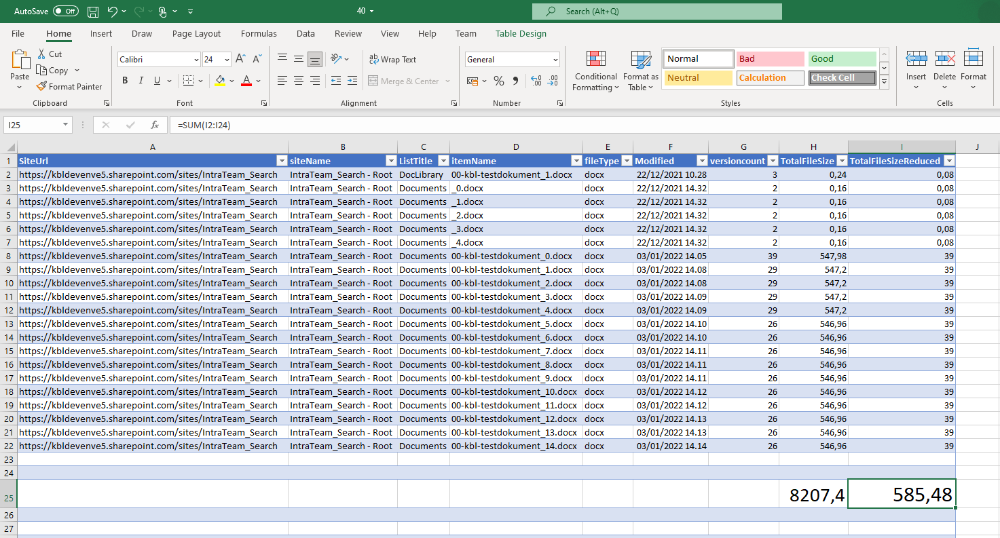

# Sample on a report showing how much SharePoint Storage you can save by trimming document versions once the site is no longer active

## Summary
The purpose of this script is to crete an overview: The total amount of SharePoint Storage used by this Site Collection, and how much could be saved by trimming the versions.


## Implementation

- Open VS Code or similar editor , ensure you are using PowerShell 7.2 or above
- Create a new file
- Write a script as below,
- Change the variables to target to your environment, site, document library, document path, max count
- Run the script.
 
## Screenshot of Output 



# [PnP.PowerShell](#tab/pnpps)
```powershell

#The purpose of this script is to crete an overview: The total amount of SharePoint Storage used by this Site Collection, and how much could be saved by trimming the versions

#Set Variables
$SharePointAdminSiteURL = "https://[tenant]-admin.sharepoint.com"
$outputPath = "C:\temp\versiontrimmer\" 

$reducedNumberOfVersions = 1
$UsingIntractive = $false
$UsingCertificate = $true
$clientID = "clientID"
$tenantId = "[tenant].onmicrosoft.com"
$certificatePassword = "pw"
$certificatePath = "C:\Users\[you]\[centname].pfx"

function HandleWeb ($site, $web, $root)
{
    try
    {
        $DocumentLibraries = Get-PnPList -Connection $connection -ErrorAction Stop| Where-Object {$_.BaseTemplate -eq 101 -and $_.Hidden -eq $false} 
        foreach($lib in  $DocumentLibraries)
        {
            if( $lib.Title -eq "Form Templates" -or $lib.Title -eq "Style Library" -or $lib.Title -eq "Site Assets")
            {
                write-host -ForegroundColor Red "skipping $($lib.Title) "    
                continue
            }
            
            write-host -ForegroundColor Green "$($lib.Title) loading items"
            try
            {
                $items = Get-PnPListItem -Connection $connection -List $lib -PageSize 500 -ErrorAction Stop
                write-host -ForegroundColor Blue "$($lib.Title) , $($items.Count)"
            }
            catch
            {
                throw $_.Exception
            }
            foreach($item in $items)
            {
                #Consider items with 1+ versions
                if(-not $item["FileRef"] -or $item.FileSystemObjectType -eq "Folder")
                {
                    continue
                }
                try
                {
                    $file = Get-PnPFile -Connection $connection -Url $item["FileRef"] -AsFileObject -ErrorAction Stop
                }
                catch
                {
                    write-host -f Red "`tError:" $_.Exception.Message            
                }

                if(-not $file)
                {
                    continue
                }
                $versions = Get-PnPProperty -Connection $connection -ClientObject $file -Property Versions 
                If ($versions.Count -gt 1)
                {
                    $versionSize=0
                    $versionSizeReduced =0

                    #Get the versioning details
                    Foreach ($FileVersion in $versions)
                    {
                        $versionSize = $versionSize + $FileVersion.Size;
                    }

                    #Get the versioning details for the reduced number of versions
                    $versions2 =$versions | Select-Object -Last $reducedNumberOfVersions
                    Foreach ($FileVersion in $versions2)
                    {
                            $versionSizeReduced = $versionSizeReduced + $FileVersion.Size;
                        
                    }
                    #To Calculate Total Size(MB)
                    $TotalFileSizeReduced= [Math]::Round(((($item.File.Length + $versionSizeReduced)/1024)/1024),2)


                    #To Calculate Total Size(MB)
                    $TotalFileSize= [Math]::Round(((($item.File.Length + $versionSize)/1024)/1024),2)

                    #Convert Size to MB
                    $VersionSize= [Math]::Round((($versionSize/1024)/1024),2)

                    #Get the Size of the current version
                    $CurrentVersionSize= [Math]::Round((($item.File.Length/1024)/1024),2)

                    #Get Site Name
                    If ($root -eq $true)
                    {
                        $siteName = $web.Title +" - Root";
                    }
                    else
                    {
                        $siteName= $web.Title 
                    }

                    #Log the data to a CSV file where versioning size > 0MB!
                    if ($versionSize -gt 0)
                    {
                        $element = "" | Select-Object SiteUrl, siteName, ListTitle, itemName, fileType, Modified, versioncount, TotalFileSize, TotalFileSizeReduced
                        $element.SiteUrl = $site
                        $element.siteName = $siteName
                        $element.ListTitle = $lib.Title
                        $element.itemName = $file.Name
                        $fileextention = $item["FileLeafRef"].Substring($item["FileLeafRef"].LastIndexOf(".")+1)
                        $element.fileType = $fileextention
                        $element.Modified = $file.TimeLastModified.tostring()
                        $element.versioncount = $versions.Count
                        $element.TotalFileSize = $TotalFileSize
                        $element.TotalFileSizeReduced = $TotalFileSizeReduced
                        $outputArray.Add($element) | Out-Null
                        Write-Host "added data for $($site.Url) $($lib.Title) , $($file.Name)"
                    }
                }
                else
                {
                    # Write-Host "only one version for $($item["FileRef"])"
                }


    #Read more: https://www.sharepointdiary.com/2013/01/document-versions-size-report-powershell.html#ixzz7F46UCAGP
                
                
            }
            
        }
    }
    catch
    {
        write-host -f Red "`tError:" $_.Exception.Message
    }
}

function Get-SiteCollections
{
    # this function is just a way to get the site collections that are in scope for the check

    $output = ""
    #$conn = Connect-PnPOnline -Url $SharePointAdminSiteURL -Credentials $Cred -ReturnConnection
    if($UsingIntractive -eq $true)
    {
        $conn = Connect-PnPOnline -Url $SharePointAdminSiteURL -Interactive -ReturnConnection
    }
    if($UsingCertificate -eq $true)
    {
        $conn = Connect-PnPOnline -Url $SharePointAdminSiteURL -ClientId $clientID -Tenant $tenantId -CertificatePath $certificatepath -CertificatePassword (ConvertTo-SecureString -AsPlainText -Force $certificatePassword) -ReturnConnection 
    }
    
    #$SiteCollections = Get-PnPTenantSite -Connection $conn  | Where-Object {$_.Template -eq "SITEPAGEPUBLISHING#0"}   #the actual filter
    $SiteCollections = Get-PnPTenantSite -Connection $conn  
    return $SiteCollections

}

 
Try {
    
    #Get the relevant Site collections 
    $SiteCollections = Get-SiteCollections
   
    $index = 0
    #Loop through each site collection
    $totalnumber = $SiteCollections.Count
    ForEach($Site in $SiteCollections) 
    { 
        $SiteURL = $Site.Url
        $outputArray = [System.Collections.ArrayList]@()
        
        Write-host -ForegroundColor Green "$($SiteURL ) , number $index of $totalnumber"
        $index++
        Try 
        {
            #Connect to site collection
            if($UsingIntractive -eq $true)
            {
                $connection = Connect-PnPOnline -Url $SiteURL -Interactive -ReturnConnection
            }
            if($UsingCertificate -eq $true)
            {
                $connection = Connect-PnPOnline -Url $SiteURL -ClientId $clientID -Tenant $tenantId -CertificatePath $certificatepath -CertificatePassword (ConvertTo-SecureString -AsPlainText -Force $certificatePassword) -ReturnConnection 
            }
            
            HandleWeb -site $SiteURL -Web (Get-PnpWeb -Connection $connection) -root $true 
            $SubSites = Get-PnPSubWeb -Recurse -Connection $connection
            
            ForEach ($web in $SubSites)
            {
                if($UsingIntractive -eq $true)
                {
                    $connection = Connect-PnPOnline -Url $web.Url -Interactive -ReturnConnection
                }
                if($UsingCertificate -eq $true)
                {
                    $connection = Connect-PnPOnline -Url $web.Url -ClientId $clientID -Tenant $tenantId -CertificatePath $certificatepath -CertificatePassword (ConvertTo-SecureString -AsPlainText -Force $certificatePassword) -ReturnConnection 
                }
                   
                Write-host "Web  : $($Web.URL)"
                HandleWeb -site $Site -web $web -root $false 
            
            }
             if($outputArray.Count -gt 0)
            {
                #calculate the total size of the potential savings
                $totalSize = 0
                $totalSizeReduced = 0
                foreach($element in $outputArray)
                {
                    $totalSize = $totalSize + $element.TotalFileSize
                    $totalSizeReduced = $totalSizeReduced + $element.TotalFileSizeReduced
                }
                $totalSize = [Math]::Round($totalSize,2)
                $totalSizeReduced = [Math]::Round($totalSizeReduced,2)
                $savings = $totalSize - $totalSizeReduced
                $savings=[Math]::Round($savings,0)

                #$outputArray  | Export-Csv -Path "$outputPath/$index.csv" -Force -Encoding utf8BOM -Delimiter "|"
                $shortSiteUrl = $SiteURL.Split("/")[-1]
                $outputArray  | Export-Csv -Path "$outputPath/$shortSiteUrl($savings).csv" -Force -Encoding utf8BOM -Delimiter "|"
                
            }
            
        }
        Catch {
            write-host -f Red "`tError:" $_.Exception.Message
        }
        finally
        {
            
        }
    }
}
Catch {
    write-host -f Red "Error:" $_.Exception.Message
}


```
[!INCLUDE [More about PnP PowerShell](../../docfx/includes/MORE-PNPPS.md)]
***

## Contributors

| Author(s) |
|-----------|
| Kasper Larsen, Fellowmind|

[!INCLUDE [DISCLAIMER](../../docfx/includes/DISCLAIMER.md)]

