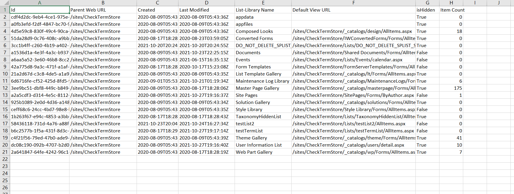

# Export all List and Libraries with Item count and Permission in CSV

## Summary
Get all lists and Libraries along with total Item count and permissions and export it in CSV file using below power shell script.


----
CLI version of the script works the same but does not retrieve permissions information from the list



# [PnP PowerShell](#tab/pnpps)
```powershell

# Make sure necessary modules are installed
# PnP PowerShell to get access to M365 tenent

Install-Module PnP.PowerShell
$siteURL = "https://tenent.sharepoint.com/sites/Dataverse"
$ReportOutput="C:\SiteInventory.csv"
$ResultData = @()
$UniquePermission = "";
#  -UseWebLogin used for 2 factor Auth.  You can remove if you don't have MFA turned on
Connect-PnPOnline -Url  $siteUrl
 # get all lists from given SharePoint Site collection
 $lists =  Get-PnPList -Includes HasUniqueRoleAssignments,RoleAssignments
 If($lists.Count -gt 0){
   foreach($list in $lists){
    $members = "";
    if($list.HasUniqueRoleAssignments -eq $false){
        $UniquePermission = "Inherited"
    }
    if($list.HasUniqueRoleAssignments -eq $true){
        $UniquePermission = "Unique"    
    }
    if($list.RoleAssignments.Count -gt 0){
        foreach($roleAssignment in $list.RoleAssignments){
            $property = Get-PnPProperty -ClientObject $roleAssignment -Property Member
            $members += $property.Title + ";"
        }
    }
     $ResultData+= New-Object PSObject -Property @{
            'List-Library Name' = $list.Title;
            'Id'=$list.Id;
            'Parent Web URL'=$list.ParentWebUrl;
            'Item Count' = $list.ItemCount;
            'Last Modified' = $list.LastItemModifiedDate.ToString();
            'Created'=$list.Created;
            'Default View URL'=$list.DefaultViewUrl;
            'Permision'=$UniquePermission;
            'Members'=$members;
            'isHidden'=$list.Hidden;
        }
   }
 }

 $ResultData | Export-Csv $ReportOutput -NoTypeInformation
```
[!INCLUDE [More about PnP PowerShell](../../docfx/includes/MORE-PNPPS.md)]


# [CLI for Microsoft 365 with PowerShell](#tab/cli-m365-ps)
```powershell

$siteURL = "https://tenent.sharepoint.com/sites/Dataverse"
$ReportOutput = "C:\SiteInventory.csv"
$ResultData = @()

$m365Status = m365 status
if ($m365Status -eq "Logged Out") {
    m365 login

}

# get all lists from given SharePoint Site collection
$lists = m365 spo list list --webUrl $siteURL
$lists = $lists | ConvertFrom-Json
If ($lists.Count -gt 0) {
    foreach ($list in $lists) {

        $listName = $list.Title
        $views = m365 spo list view list --webUrl $siteURL --listTitle $listName
        $views = $views | ConvertFrom-Json
        $defaultView = $views | Where-Object {$_.DefaultView -eq "True"}

        $ResultData += New-Object PSObject -Property @{
            'List-Library Name' = $listName;
            'Id'                = $list.Id;
            'Parent Web URL'    = $list.ParentWebUrl;
            'Item Count'        = $list.ItemCount;
            'Last Modified'     = $list.LastItemModifiedDate.ToString();
            'Created'           = $list.Created;
            'Default View URL'  = $defaultView.ServerRelativeUrl;
            'isHidden'          = $list.Hidden;
        }
    }
}

$ResultData | Export-Csv $ReportOutput -NoTypeInformation

```
[!INCLUDE [More about CLI for Microsoft 365](../../docfx/includes/MORE-CLIM365.md)]
***

## Contributors

| Author(s) |
|-----------|
| [Dipen Shah](https://github.com/dips365) |
| [Adam Wójcik](https://github.com/Adam-it)|


[!INCLUDE [DISCLAIMER](../../docfx/includes/DISCLAIMER.md)]
