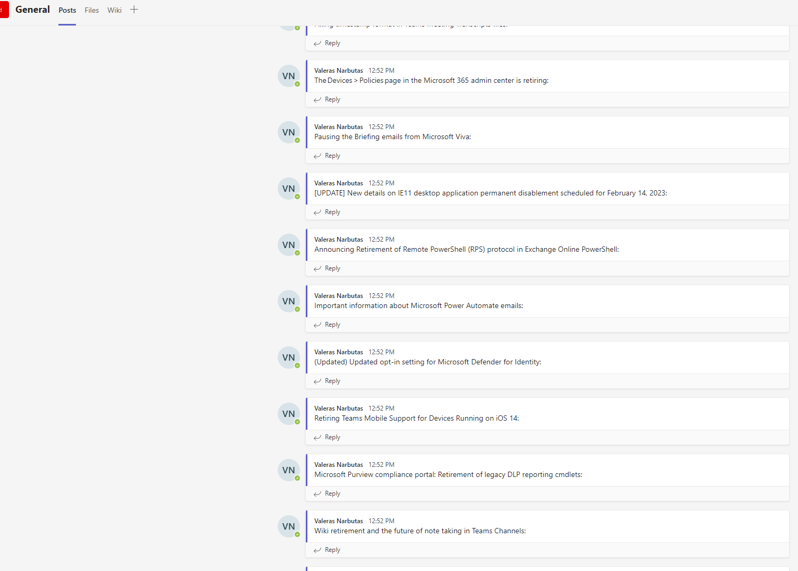

# Retrieve Message Centre announcements and post to MS Teams channel

## Summary

This script allows you to connect to your SharePoint Online tenant and retrieve Message Centre announcements. It then connects to Microsoft Teams and loops through the announcements, posting them to a specific Teams channel.



## Implementation

- Create csv file with the list of site collection URLs to enable app catalog
- Open Windows PowerShell ISE
- Create a new file
- Copy the code below
- Save the file and run it

# [PnP PowerShell](#tab/pnpps)

```powershell
# Connect to SharePoint Online
Connect-PnPOnline -Url https://yourTenantName.sharepoint.com/ -Interactive 

# Get Message Centre announcements
$announcements = Get-PnPMessageCenterAnnouncement | Where-Object { $_.Category -eq "PlanForChange" } | Select-Object Title, Description

# Connect to teams
Connect-MicrosoftTeams 

# Loop through the announcements and post to Teams channel
foreach ($announcement in $announcements) {
    $message = "$($announcement.Title): $($announcement.Description)"
    Submit-PnPTeamsChannelMessage -Team "TeamID" -Channel "General" -Message $message
}

```
[!INCLUDE [More about PnP PowerShell](../../docfx/includes/MORE-PNPPS.md)]

# [CLI for Microsoft 365 with PowerShell](#tab/cli-m365-ps)

As of now, CLI for M365 does not support sending message on the Teams channel. As a workaround, you need to [create incoming webhook](https://learn.microsoft.com/en-us/microsoftteams/platform/webhooks-and-connectors/how-to/add-incoming-webhook) which  lets external applications to share content in Microsoft Teams channels.

```powershell
# Example: .\Send-MessageCenterAnnouncementsToMSTeams.ps1 -Category "planForChange" -IncomingWebhookUrl "https://contoso.webhook.office.com/webhookb2/72e6dbda-4965-4516-9454-c3adf90aaf01@de348bc7-1aeb-4406-8cb3-97db021cadb4/IncomingWebhook/fb1ca3be60c94e00b7afb2510cd681ee/e1251b10-1ba4-49e3-b35a-933e3f21772b"

[CmdletBinding()]
param (
    [Parameter(Mandatory = $false, HelpMessage = "Specify category of the message center announcement")]
    [string]$Category = "planForChange",
    [parameter(Mandatory = $true)][string]$IncomingWebhookUrl
)

begin {
    #Log in to Microsoft 365
    Write-Host "Connecting to Tenant" -f Yellow

    $m365Status = m365 status
    if ($m365Status -match "Logged Out") {
        m365 login
    }

    Write-Host "Connection Successful!" -f Green
}
process {
    # Get Message Centre announcements
    $announcements = m365 tenant serviceannouncement message list --query "[?category == '$($Category)']" | ConvertFrom-Json
    Write-Host "Found $($announcements.Count) announcements to post to MS Teams channel"

    # Loop through the announcements and post to Teams channel
    foreach ($announcement in $announcements) {
        Write-Host "Sending message $($announcement.Title)..."
		
        $jsonBody = [PSCustomObject][Ordered]@{
            "@type"      = "MessageCard"
            "@context"   = "http://schema.org/extensions"
            "summary"    = $announcement.Title
            "themeColor" = '0078D7'
            "title"      = $announcement.Title
            "text"       = $announcement.body.content
        }		

        $parameters = @{
            "URI"         = $IncomingWebhookUrl
            "Method"      = 'POST'
            "Body"        = ConvertTo-Json $jsonBody
            "ContentType" = 'application/json'
        }

        Invoke-RestMethod @parameters | Out-Null
    }
}
end {
    #m365 logout
    Write-Host "Finished" -ForegroundColor Green
}
```
[!INCLUDE [More about CLI for Microsoft 365](../../docfx/includes/MORE-CLIM365.md)]

***

## Contributors

| Author(s) |
|-----------|
| Valeras Narbutas |
| [Nanddeep Nachan](https://github.com/nanddeepn) |

[!INCLUDE [DISCLAIMER](../../docfx/includes/DISCLAIMER.md)]

