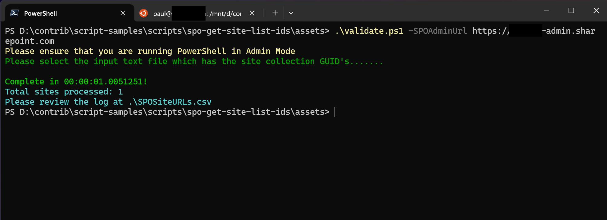

# Get Site Ids to URL

## Summary

Converts unique site IDs from a txt file to URLs for M365 Tenancy and exports to CSV.



Lorem ipsum dolor sit amet, consectetuer adipiscing elit. Maecenas porttitor congue massa. Fusce posuere, magna sed pulvinar ultricies, purus lectus malesuada libero, sit amet commodo magna eros quis urna.Nunc viverra imperdiet enim. Fusce est. Vivamus a tellus.Pellentesque habitant morbi tristique senectus et netus et malesuada fames ac turpis egestas. Proin pharetra nonummy pede. Mauris et orci.Aenean nec lorem. In porttitor. Donec laoreet nonummy augue.

# [PnP PowerShell](#tab/pnpps)

```powershell

param(
    [Parameter(Mandatory=$true)]
    [ValidatePattern("^https://.*\.sharepoint\.com$", ErrorMessage="Please enter a valid SharePoint Online Admin URL")]
    [string]$SPOAdminURL = $(Read-Host -Prompt "Please enter the SharePoint Online Admin URL"),
   
    [Parameter(Mandatory=$false)]
    [string]$log = ".\SPOSiteURLs.csv"
)

## Load Form Selector
Add-Type -AssemblyName System.Windows.Forms

function Select-FileDialog {
    param([string]$Title, [string]$Directory, [string]$Filter="All Files (*.*)|*.*")
    $objForm = New-Object System.Windows.Forms.OpenFileDialog
    $objForm.InitialDirectory = $Directory
    $objForm.Filter = $Filter
    $objForm.Title = $Title
    $Show = $objForm.ShowDialog()
    if ($Show -eq "OK") {
        return $objForm.FileName
    } else {
        Write-Error "Operation cancelled by user."
        exit
    }
}

## Check Execution Policy
$currentPolicy = Get-ExecutionPolicy
if ($currentPolicy -ne "Unrestricted") {
    Write-Host "Current execution policy is $currentPolicy. This script requires it to be Unrestricted." -ForegroundColor Yellow
    try {
        Set-ExecutionPolicy Unrestricted -Scope Process -Force
        Write-Host "Execution policy set to Unrestricted for this session." -ForegroundColor Green
    } catch {
        Write-Error "Failed to set execution policy. Please run PowerShell as an administrator and try again."
        exit
    }
}

## Check to see if PNP is installed
Write-Host "Please ensure that you are running PowerShell in Admin Mode" -ForegroundColor Yellow
$CheckPNP = Get-Module -Name PnP.PowerShell -ListAvailable
if ($CheckPNP -eq $null) {
    Write-Host "It appears you do not have SharePoint Online PNP installed!" -ForegroundColor Red
    $Force = Read-Host "Would you like to install SharePoint Online PNP Module? Type 'Y' to force or type 'N' to continue"
    if ($Force -like "y") {
        try {
            Install-Module -Name PnP.PowerShell -Force -ErrorAction Stop
            Import-Module PnP.PowerShell -ErrorAction Stop
            Write-Host "PnP PowerShell module installed successfully." -ForegroundColor Green
        } catch {
            Write-Error "Failed to install PnP PowerShell module. Exiting script."
            exit
        }
    } elseif ($Force -like "n") {
        Write-Host "Continuing without install of PNP and assuming module was not detected properly" -ForegroundColor Yellow
    }
}

# Select Input File
Write-Host "Please select the input text file which has the site collection GUID's......." -ForegroundColor DarkGreen
$InputFile = Select-FileDialog -Title "Select the input file of site ID's to convert to URL's"

if (-not (Test-Path -Path $InputFile -PathType Leaf)) {
    Write-Error "The selected file does not exist. Exiting script."
    exit
}

$cnt = Get-Content $InputFile

$starttime = Get-Date

## Connect to PNP PowerShell
try {
    Connect-PnPOnline -Url $SPOAdminURL -Interactive -ErrorAction Stop
} catch {
    Write-Error "Failed to connect to SharePoint Online. Please check your admin URL and credentials."
    exit
}

## Create Result Set
[System.Collections.Generic.List[PSCustomObject]] $results = New-Object System.Collections.Generic.List[PSCustomObject]

$count = 0

foreach ($siteid in $cnt) {
    try {
        Write-Progress -Activity 'Processing sites..' -Status $siteid -PercentComplete ($count / $cnt.count * 100)
        $query = "SiteId:$siteid contentClass:STS_Site"
        $result = Submit-PnPSearchQuery -Query $query -ErrorAction Stop
        foreach ($row in $result.ResultRows) {
            $res = New-Object psobject
            foreach ($key in $row.Keys) {
                $res | Add-Member -MemberType NoteProperty -Name $key -Value $row[$key]
            }
            $results.Add($res)
        }
        $count++
    } catch {
        Write-Host "Failed to process $siteid. Error: $_" -ForegroundColor Red
        continue
    }
}

try {
    $results | Export-Csv -Path $log -NoTypeInformation -Force -Append
} catch {
    Write-Error "Failed to export results to CSV. Error: $_"
    exit
}

$duration = (Get-Date) - $starttime
Write-Host "`nComplete in $($duration)!" -ForegroundColor Green
Write-Host "Total sites processed: $count" -ForegroundColor Cyan
Write-Host "Please review the log at $($log)" -ForegroundColor Cyan 

```
[!INCLUDE [More about PnP PowerShell](../../docfx/includes/MORE-PNPPS.md)]
***

## Source

This script was first created on PnP PowerShell and transferred over in Dec 2024.
https://github.com/pnp/powershell


## Contributors

| Author(s) |
|-----------|
| Sam Larson |

[!INCLUDE [DISCLAIMER](../../docfx/includes/DISCLAIMER.md)]

