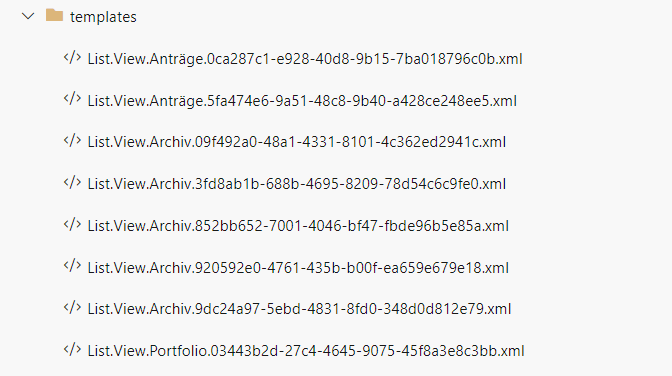

# Export / Import list formatting

## Summary

SharePoint Online provides user interface for defining column and view formatting and forms configuration:
- [Use view formatting to customize SharePoint](https://learn.microsoft.com/sharepoint/dev/declarative-customization/view-formatting), 
- [Show or hide columns in a list or library form](https://learn.microsoft.com/sharepoint/dev/declarative-customization/list-form-conditional-show-hide) and 
- [Configure the list form](https://learn.microsoft.com/sharepoint/dev/declarative-customization/list-form-configuration). 

However, the `Get-PnPSiteTemplate -Handlers Lists` command does not include these customizations. These scripts bridge this gap.
The Get-ListFormatting script exports:
- form customizers 
- list views
- list views formatting
- columns formatting 

to a set of json, csv and xml files. The Set-SPOListFormatting applies the exported customizations to an existing list. 



Use it with `Get-PnPSiteTemplate` and `Invoke-PnPSiteTemplate` for a full export / import capabilities.

# [PnP PowerShell](#tab/pnpps)

```powershell

function Get-ListFormatting {
    [CmdletBinding()]
    param (
        [Parameter()]
        [string]
        $listName,
        [string]
        $folderPath
    )

    $clientContext = Get-PnPContext
    $list = Get-PnPList $listName -Includes SchemaXml

    # Currently only Item content type is supported. The script may be easily adapted to enumerate through all the available content types
    $contentType = Get-PnPContentType -List $listName | Where-Object { $_.Name -eq "Item"}
    $clientContext.Load($list.Views)
    $clientContext.Load($contentType)
    $clientContext.Load($contentType.FieldLinks)
    $clientContext.ExecuteQuery()

    # 1. Get form customizer
    $contentType.ClientFormCustomFormatter | Out-File "$folderPath\ListFormatting.Form.$listName.json"
    # 2.Get fieldLinks settings
    $contentType.FieldLinks | Select-Object Name, Hidden, Id |  Export-Csv  "$folderPath\ListFormatting.ColumnOrder.$listName.csv" -NoTypeInformation

    # 3. Get list views 
    $listUrl=$list.RootFolder.ServerRelativeUrl+"/"
    $list.Views | Where-Object { $_.PersonalView -eq $false } | Select-Object Title, Id, @{name = "Url"; expression = { $_.ServerRelativeUrl.Replace($listUrl,"").Replace(".aspx","") } } | Export-Csv  "$folderPath\List.Views.$listName.csv" -NoTypeInformation
    $list.Views | ForEach-Object {
        $v = Get-PnPView -List $list -Identity $_.Id -Includes HtmlSchemaXml 
        $v.HtmlSchemaXml |  Out-File "$folderPath\List.View.$listName.$($_.Id).xml"
    }

    #get list views formatting
    $views = $list.Views | Where-Object { $null -ne $_.CustomFormatter } 
    if($null -ne $views){
        $views | Select-Object Title, Id | Export-Csv  "$folderPath\ListFormatting.Views.$listName.csv" -NoTypeInformation
        $views | ForEach-Object {
            $_.CustomFormatter | Out-File "$folderPath\ListFormatting.View.$listName.$($_.Id).json"
        }
    }

    #get columns formatting
    $columns= Get-PnPField -List $listName | Where-Object {$null -ne $_.CustomFormatter } 
    if($null -ne $columns){
        $columns | Select-Object InternalName | Export-Csv   "$folderPath\ListFormatting.Columns.$listName.csv" -NoTypeInformation
        $columns | ForEach-Object {
            $_.CustomFormatter | Out-File "$folderPath\ListFormatting.Column.$listName.$($_.InternalName).json"
        }
    }
}

function Set-ListFormatting {
    [CmdletBinding()]
    param (
        [Parameter()]
        [string]
        $listName,
        [string]
        $folderPath
    )
    if (Test-Path -Path $folderPath){

        Write-Host "LIST $listName "
        $clientContext = Get-PnPContext
        $list = Get-PnPList $listName

        #Get Content Type
        $contentType = Get-PnPContentType -List $listName | Where-Object { $_.Name -eq "Item" -or $_.Name -eq "Element" }
        $clientContext.Load($contentType)
        $clientContext.Load($contentType.FieldLinks)
        $clientContext.ExecuteQuery()

        # 1. Set form customizers
        if ($t=Test-Path -Path "$folderPath\ListFormatting.Form.$listName.json" -PathType leaf){
            Write-Host "Setting form customizers from $folderPath\ListFormatting.Form.$listName.json"
            $contentType.ClientFormCustomFormatter = (Get-Content -Raw -Path "$folderPath\ListFormatting.Form.$listName.json").ToString()
            Write-Host "...done"
        }
        # 2.a Set fieldLinks order
        if ($t=Test-Path -Path "$folderPath\ListFormatting.ColumnOrder.$listName.csv" -PathType leaf) {
            Write-Host "Setting fields order from $folderPath\ListFormatting.ColumnOrder.$listName.csv"

            $ColumnOrder = (Import-Csv "$folderPath\ListFormatting.ColumnOrder.$listName.csv").Name
            $contentType.FieldLinks.Reorder($ColumnOrder)
            Write-Host "...done"
        }
        # 2.b Set fieldLinks.Hidden 
        if ($t = Test-Path -Path "$folderPath\ListFormatting.ColumnOrder.$listName.csv" -PathType leaf) {
            Write-Host "Setting hidden fields from $folderPath\ListFormatting.ColumnOrder.$listName.csv"
            
            Import-Csv "$folderPath\ListFormatting.ColumnOrder.$listName.csv" | ForEach-Object{
                $contentType.FieldLinks.GetById($_.Id).Hidden = [System.Convert]::ToBoolean($_.Hidden)
            }
            Write-Host "...done"
        }
        $contentType.Update(0)
        $clientContext.ExecuteQuery()

        # 3. Set list views
        if ($t = Test-Path -Path  "$folderPath\List.Views.$listName.csv" -PathType leaf) {
            Write-Host "Setting views"
            
            #Get All List Views 
            $clientContext.Load($list.Views)
            $clientContext.ExecuteQuery()
            $listUrl=$list.RootFolder.ServerRelativeUrl+"/"
            $views = $list.Views | Select-Object Title, @{name = "Url"; expression = { $_.ServerRelativeUrl.Replace($listUrl, "").Replace(".aspx", "")}}

            Import-Csv "$folderPath\List.Views.$listName.csv" | ForEach-Object {

                $xml = [xml]( Get-Content "$folderPath\List.View.$listName.$($_.Id).xml" -Raw)
                $isDefault = [boolean]$xml.View.DefaultView
                $fields =  $xml.View.ViewFields.FieldRef.Name 
                $query = $xml.View.Query.InnerXml
                $aggregations = $xml.View.Aggregations.InnerXml
                $viewType2 = $xml.View.ViewType2

                $url = $_.Url
                $viewTitle = ($views | Where-Object { $_.Url -eq $url } ).Title

                if($null -ne $viewTitle){
                    Write-Host "Updating view $viewTitle to $($_.Title)"
                    $v = Set-PnPView -List $listName -Identity $viewTitle -Fields $fields -Values @{Title = $_.Title; ViewQuery = $query; ViewType2 = $viewType2 } -Aggregations $aggregations
                }
                else{
                    Write-Host "Creating view $($_.Title)"
                    #cannot set view url when creating the list. the following workaroud required
                    $v = Add-PnPView -List $listName -Title $_.Url  -SetAsDefault:$isDefault -Fields $fields -Query $query -Aggregations $aggregations
                    $v = Set-PnPView -List $listName -Identity $_.Url -Values @{Title = $_.Title ; ViewType2 = $viewType2} 
                }
            }
        }

        #Set list views formatting
        if ($t=Test-Path -Path "$folderPath\ListFormatting.Views.$listName.csv" -PathType leaf){
            Write-Host "Setting  list views formatting"

            #Get All List Views 
            $clientContext.Load($list.Views)
            $clientContext.ExecuteQuery()
            $views = $list.Views.Title

            #Get exported Views Info (Title & Id)
            Import-Csv "$folderPath\ListFormatting.Views.$listName.csv" | ForEach-Object{
                #If target list contains the view and the file exists
                if ($views.Contains($_.Title) ) {
                    # Update the List View Formatting Definition
                    $listViewFormattingJSON = Get-Content -Raw -Path "$folderPath\ListFormatting.View.$listName.$($_.Id).json";
                    $listViewColumnDefinition = Get-PnPView -List $listName -Identity $_.Title  
                    $listViewColumnDefinition | Set-PnPView -Values  @{CustomFormatter = $listViewFormattingJSON.ToString() }
                }
            }
        }
        #Set columns formatting
        if ($t=Test-Path -Path "$folderPath\ListFormatting.Columns.$listName.csv" -PathType leaf) {
            Write-Host "Setting columns formatting"

            #Get All List Columns
            $clientContext.Load($list.Fields)
            $clientContext.ExecuteQuery()
            $columns = $list.Fields.InternalName

            Import-Csv "$folderPath\ListFormatting.Columns.$listName.csv"  | ForEach-Object { #$columns.Contains($_.InternalName)
                if ($columns.Contains($_.InternalName)){
                    Write-Host "Setting formatter for $($_.InternalName)"
                    $ColumnFormattingJSON = Get-Content -Raw -Path "$folderPath\ListFormatting.Column.$listName.$($_.InternalName).json";
                    $listColumnDefinition = Get-PnPField -List $listName -Identity $_.InternalName
                    $listColumnDefinition | Set-PnPField -Values @{CustomFormatter = $ColumnFormattingJSON.ToString() }
                }
            }
        }
        
    }
}


### Example usage
$list1= "MyList1"
$folderPath= "C:\SPO\Templates"

Connect-PnPOnline -Credentials $PSCredentials -Url $siteUrl 

##Export
Get-PnPSiteTemplate  -Out "$folderPath/ListTemplates.xml" -ListsToExtract $list1 -Handlers Lists 
Get-ListFormatting -folderPath $folderPath -listName $list1

##Import
Invoke-PnPSiteTemplate -Path "$folderPath/ListTemplates.xml"
Set-ListFormatting -folderPath $folderPath -listName $list1


```
[!INCLUDE [More about PnP PowerShell](../../docfx/includes/MORE-PNPPS.md)]

***

## Contributors

| Author(s) |
|-----------|
| Kinga Kazala |


[!INCLUDE [DISCLAIMER](../../docfx/includes/DISCLAIMER.md)]

