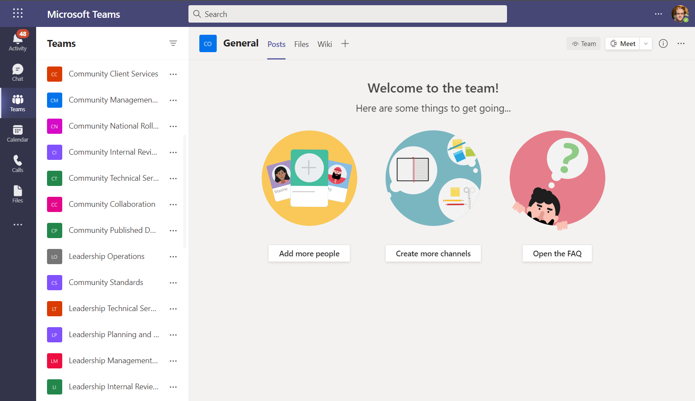

# Bulk Create Teams with JSON File

## Summary

We had a scenario to manage teams in an environment that we needed to test governance scenarios requiring us to make over a 1000 teams. So we created a script that could generate the required teams, to build a lot of teams without having to generate a long list of team names, we used a prefix series to help build this out, additionally we added to the team name, a suffix to enable us to find all test based teams.



Few points to note:

- This application uses an Azure AD app to provision teams with the certificate installed on the executing machine.
- The script requires the JSON block saved as "teams.json" to run.
- The execution time to create each team varies between 5-30 secs per team
- The JSON + Script examples will generate 100 teams.

# [PnP PowerShell](#tab/pnpps)
```powershell

[CmdletBinding()]
param (
    [string] $Tenant = "contoso",
    [string] $SiteUrlSuffix = "-Test",
    [string] $OwnerEmail = "paul.bullock@contoso.co.uk",
    [string] $SiteListJsonFile = ".\teams.json",
    [string] $Template = "STS#3",
    [string] $ClientId = "5fc099aa-d7ad-4da6-a3ca-5793facc5ed3",
    [string] $ThumbPrint = "EE20D40FC1EE7EE5BEC8512617CA469718DA123D"
)
begin{

    $adminUrl = "https://$($Tenant)-admin.sharepoint.com"
    Write-Host "Connecting to SharePoint Admin..."
    $adminConn = Connect-PnPOnline -ClientId $ClientId -Thumbprint $ThumbPrint -Tenant contoso.co.uk -Url $adminUrl -ReturnConnection

    $baseUrl = "https://$($Tenant).sharepoint.com/sites/"
    $jsonFilePath = "$($SiteListJsonFile)"
    $sites = Get-Content $jsonFilePath -Raw | ConvertFrom-Json

    $prefixes = "HR","Finance","ICT","Service Desk","Client Services","Project Alpha","Project Beta","Project Charlie","Leadership","Community"
}
process {

    $prefixes | Foreach-Object{

        $prefix = $_

        $sites |  Foreach-Object {

            $siteUrl = "$($baseUrl)$($_.SiteUrl.Replace("XXXXX", $prefix).Replace(" ",''))$($SiteUrlSuffix)"
            $siteTitle = "$($_.SiteTitle.Replace("XXXXX", $prefix))"
            $mailNickname = "$($_.SiteUrl.Replace("XXXXX", $prefix).Replace(" ",''))$($SiteUrlSuffix)"

            # Check for existing site
            Write-Host "Checking for existing site $($siteUrl)"
            $existingSite = Get-PnPTenantSite $siteUrl -ErrorAction Silent -Connection $adminConn

            if ($existingSite -eq $null) {

                Write-Host " - Creating new Team...." -ForegroundColor Cyan
                New-PnPMicrosoft365Group  -DisplayName $siteTitle -Description "Testing Site for $($siteTitle)" -MailNickname $mailNickname `
                        -Owners $OwnerEmail -IsPrivate:(!$_.IsPublic) -CreateTeam     
                
            }else{
                Write-Host " - Site Exists... Skipping" -ForegroundColor Yellow
            }

        }
    }
}
end{

  Write-Host "Done! :)" -ForegroundColor Green
}
```

[!INCLUDE [More about PnP PowerShell](../../docfx/includes/MORE-PNPPS.md)]

# [CLI for Microsoft 365](#tab/cli-m365-ps)
```powershell
# Usage example:
# .\Create-BulkTeams.ps1 -OwnerEmail "user@contoso.com"

[CmdletBinding()]
param (
    [Parameter(Mandatory = $true)]
    [string]$OwnerEmail,
    [Parameter(Mandatory = $false)]
    [string] $SiteListJsonFile = ".\teams.json"
)
begin {
    #Log in to Microsoft 365
    Write-Host "Connecting to Tenant" -f Yellow

    $m365Status = m365 status
    if ($m365Status -match "Logged Out") {
        m365 login
    }

    Write-Host "Connection Successful!" -f Green

    $sites = Get-Content $SiteListJsonFile -Raw | ConvertFrom-Json
    $prefixes = "HR", "Finance", "ICT", "Service Desk", "Client Services", "Project Alpha", "Project Beta", "Project Charlie", "Leadership", "Community"
}
process {
    $prefixes | Foreach-Object {
        $prefix = $_

        $sites | Foreach-Object {
            $siteTitle = "$($_.SiteTitle.Replace("XXXXX", $prefix))"
            $mailNickname = "$($_.SiteUrl.Replace("XXXXX", $prefix).Replace(" ",''))"

            # Check if team exists
            $team = m365 teams team get --name $siteTitle | ConvertFrom-Json

            if (-not $team) {
                # Create a Microsoft 365 Group                
                Write-Host "Creating group $($siteTitle)"

                # If the $OwnerEmail is the tenant admin then this will break.
                # This is a very special case where when we create a new o365group, 
                # the tenant admin will be by default the member of this group internally. 
                # Then when we want to add the same user as the owner of this group we will get the following error:
                # Error: One or more added object references already exist for the following modified properties: 'owners'.
                m365 aad o365group add --displayName "$($siteTitle)" --description "Testing Site for $($siteTitle)" --mailNickname $mailNickname --owners "$($OwnerEmail)" --isPrivate (!$_.IsPublic).ToString().ToLowerInvariant()

                $group = $null
                $waitTime = 5
                $trial = 0
                $maxRetry = 3

                do {
                    $trial++
                    Write-Host "Waiting $waitTime seconds before group provisioning is complete..."
                    Start-Sleep -Seconds $waitTime

                    $group = m365 aad o365group list --displayName "$($siteTitle)" | ConvertFrom-Json
                } while ($group -eq $null -and $trial -lt $maxRetry)

                if ($group -eq $null) { 
                    return
                }

                # Create a new Microsoft Teams team under existing Microsoft 365 group
                Write-Host "Creating Microsoft Teams team under group $($siteTitle)"
                m365 aad o365group teamify --mailNickname $mailNickname
            }
            else {
                Write-Host "Microsoft Teams team $($siteTitle) already exists"
            }
        }
    }
}
end {
    Write-Host "Finished" -ForegroundColor Green
}
```
[!INCLUDE [More about CLI for Microsoft 365](../../docfx/includes/MORE-CLIM365.md)]

# [JSON](#tab/json)
```json
[
    {"SiteTitle":"XXXXX Collaboration", "SiteUrl":"XXXXX-Collaboration", "IsPublic":true},
    {"SiteTitle":"XXXXX Standards", "SiteUrl":"XXXXX-Standards", "IsPublic":true},
    {"SiteTitle":"XXXXX Published Documents", "SiteUrl":"XXXXX-PublishedDocuments", "IsPublic":false},
    {"SiteTitle":"XXXXX Client Services", "SiteUrl":"XXXXX-ClientServices", "IsPublic":false},
    {"SiteTitle":"XXXXX Management Team", "SiteUrl":"XXXXX-ManagementTeam", "IsPublic":false},
    {"SiteTitle":"XXXXX National Rollout", "SiteUrl":"XXXXX-NationalRollout", "IsPublic":false},
    {"SiteTitle":"XXXXX Internal Review and Audit", "SiteUrl":"XXXXX-InternalReviewAndAudit", "IsPublic":false},
    {"SiteTitle":"XXXXX Technical Services", "SiteUrl":"XXXXX-TechnicalServices", "IsPublic":false},
    {"SiteTitle":"XXXXX Planning and Performance", "SiteUrl":"XXXXX-PlanningAndPerformance", "IsPublic":false},
    {"SiteTitle":"XXXXX Operations", "SiteUrl":"XXXXX-Operations", "IsPublic":false}
]
```

> Note: the XXXXX will be replaced as part of the script

***


## Contributors

| Author(s) |
|-----------|
| Paul Bullock |


[!INCLUDE [DISCLAIMER](../../docfx/includes/DISCLAIMER.md)]

