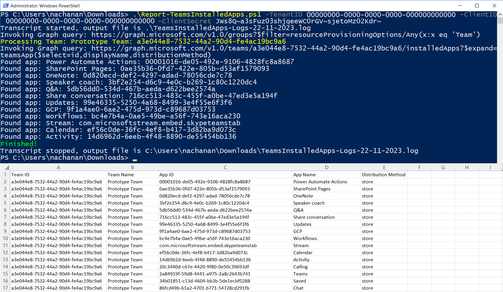

# List apps within Teams in a tenant

## Summary

This script lists all installed apps in Microsoft Teams teams in the tenant and exports the results in a CSV.



## Permissions

The PowerShell version of the script requires Microsoft Entra ID App Registration with the Application Permissions as follows:
1. Directory.Read.All
2. TeamsAppInstallation.ReadForTeam.All


> Note: You can skip this step, if you are planning to use CLI for Microsoft 365.

## Implementation

- Open Windows PowerShell ISE
- Create a new file
- Copy the code below
- Save the file and run it


# [PowerShell](#tab/ps)

```powershell
[CmdletBinding()]
param (
    [parameter(Mandatory)][string] $TenantID,
    [parameter(Mandatory)][string] $ClientID,
    [parameter(Mandatory)][string] $ClientSecret
)

function Get-AccessToken {
    # Construct URI
    $uri = "https://login.microsoftonline.com/$TenantID/oauth2/v2.0/token"
	
    # Construct Body
    $body = @{
        client_id     = $ClientID
        client_secret = $ClientSecret
        scope         = 'https://graph.microsoft.com/.default'
        grant_type    = 'client_credentials'
    }
	
    # Fix for issue: The underlying connection was closed
    [Net.ServicePointManager]::SecurityProtocol = [Net.SecurityProtocolType]::Tls12

    # Get OAuth 2.0 Token
    $tokenRequest = Invoke-WebRequest -Method Post -Uri $uri -ContentType 'application/x-www-form-urlencoded' -Body $body -UseBasicParsing
	
    # Access Token
    return ($tokenRequest.Content | ConvertFrom-Json).access_token
}
  
function Get-GraphQueryOutput {
    param(
        [parameter(Mandatory = $true)][String] $Uri
    )

    $retryCount = 0
    $maxRetries = 3
    $pauseDuration = 2
    
    $token = Get-AccessToken
  
    $allRecords = @()
    while ($Uri) {
        try {
            Write-Host "Invoking Graph query: $($Uri)"
            $query = Invoke-RestMethod -Method Get -Uri $Uri -ContentType 'application/json;odata.metadata=none' -Headers @{Authorization = "Bearer $token" }
            $recordToAdd = ($query | Select-Object Value).Value
			
            if (-not $recordToAdd) {
                $recordToAdd = $query
            }

            $allRecords += $recordToAdd

            if ($query.'@odata.nextLink') {
                # set the url to get the next page of records
                $Uri = $query.'@odata.nextLink'
            } 
            else {
                $Uri = $null
            }  
        } 
        catch {
            Write-Host "StatusCode: " $_.Exception.Response.StatusCode.value__
            Write-Host "StatusDescription:" $_.Exception.Response.StatusDescription

            if ($_.Exception.Response.StatusCode.value__ -eq 401) {
                $token = Get-AccessToken
            }
  
            if ($_.ErrorDetails.Message) {
                Write-Host "Inner Error: $_.ErrorDetails.Message" -ForegroundColor Red
            }

            if ($_.Exception.Response.StatusCode.value__ -eq 404) {
                # If the error is "Not Found", let us not retry
                $retryCount = $maxRetries + 1
            }
            
            if ($retryCount -ge $maxRetries) {
                # Not going to retry again
                $Uri = $null
                Write-Host "Not going to retry..." -ForegroundColor Red
            } 
            else {
                $retryCount += 1
                $pauseDuration = $pauseDuration * 5
                Write-Host "Retry attempt $retryCount after a $pauseDuration second pause..." -ForegroundColor Yellow
                Start-Sleep -Seconds $pauseDuration
            }
        }
    }

    return $allRecords
}

Start-Transcript -Path ".\TeamsInstalledApps-Logs-$((Get-Date).toString("dd-MM-yyyy")).log"
$allTeams = Get-GraphQueryOutput -Uri "https://graph.microsoft.com/v1.0/groups?`$filter=resourceProvisioningOptions/Any(x:x eq 'Team')"

ForEach ($team in $allTeams) {
    Write-Host "Processing Team: $($team.displayName): $($team.id)" -ForegroundColor Yellow

    $installedApps = Get-GraphQueryOutput -Uri "https://graph.microsoft.com/v1.0/teams/$($team.id)/installedApps?`$expand=teamsApp(`$select=id,displayName,distributionMethod)"
    ForEach ($app in $installedApps) {
        Write-Host "Found app: $($app.teamsApp.displayName): $($app.teamsApp.id)"

        $reportLine = [PSCustomObject][Ordered]@{
            "Team ID"             = $team.id
            "Team Name"           = $team.displayName
            "App ID"              = $app.teamsApp.id
            "App Name"            = $app.teamsApp.displayName
            "Distribution Method" = $app.teamsApp.distributionMethod
        }

        $reportLine | Export-Csv -NoTypeInformation -Path ".\TeamsInstalledApps-$((Get-Date).toString("dd-MM-yyyy")).csv" -Encoding UTF8 -Append
    }
}

Write-Host "Finished!" -ForegroundColor Green
Stop-Transcript
```
[!INCLUDE [More about PowerShell](../../docfx/includes/MORE-PS.md)]

# [CLI for Microsoft 365](#tab/cli-m365-ps)

```powershell
begin {
    Write-Host "Connecting..." -ForegroundColor Yellow   
    $m365Status = m365 status
  
    if ($m365Status -match "Logged Out") {
        m365 login
    }
}
process {
    # Retrieve all teams in Microsoft Teams
    $msTeams = m365 teams team list | ConvertFrom-Json

    $msTeams | ForEach-Object {
        Write-Host "Processing Team: $($_.displayName): $($_.ID)" -ForegroundColor Yellow
        $installedApps = m365 teams team app list --teamId $_.ID | ConvertFrom-Json

        ForEach ($app in $installedApps) {
            Write-Host "Found app: $($app.teamsApp.displayName): $($app.teamsApp.id)"

            $reportLine = [PSCustomObject][Ordered]@{
                "Team ID"             = $_.ID
                "Team Name"           = $_.displayName
                "App ID"              = $app.teamsApp.id
                "App Name"            = $app.teamsApp.displayName
                "Distribution Method" = $app.teamsApp.distributionMethod
            }

            $reportLine | Export-Csv -NoTypeInformation -Path ".\TeamsInstalledApps-$((Get-Date).toString("dd-MM-yyyy")).csv" -Encoding UTF8 -Append
        }
    }
}
end {
    Write-Host "Finished!" -ForegroundColor Green
}
```

[!INCLUDE [More about CLI for Microsoft 365](../../docfx/includes/MORE-CLIM365.md)]

***

## Contributors

| Author(s) |
|-----------|
| [Smita Nachan](https://github.com/SmitaNachan) |
| [Nanddeep Nachan](https://github.com/nanddeepn) |

## References

- [List apps in team](https://learn.microsoft.com/en-us/graph/api/team-list-installedapps?view=graph-rest-1.0&tabs=http)
- [List all teams in Microsoft Teams for an organization](https://learn.microsoft.com/en-us/graph/teams-list-all-teams)


[!INCLUDE [DISCLAIMER](../../docfx/includes/DISCLAIMER.md)]
