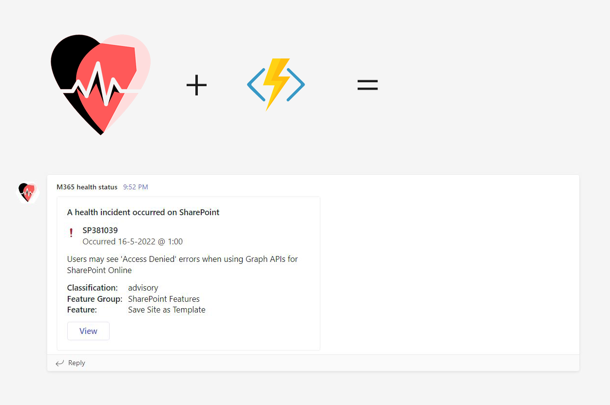

# Get notified in Microsoft Teams about SharePoint health incidents

## Summary

This script can be used to monitor the health status of your SharePoint tenant. If service incidents occur, a notification is sent to a Microsoft Teams channel. For notifications, the script posts an Adaptive Card to an Incoming Webhook. The script caches health incidents in a SharePoint list.



### Script Overview

1. This script uses the command [tenant serviceannouncement healthissue list](https://pnp.github.io/cli-microsoft365/cmd/tenant/serviceannouncement/serviceannouncement-healthissue-list/) to get a list of unresolved SharePoint health issues.
2. The script caches the id of the health issues in a SharePoint list. The SharePoint list is created if it does not exist.
3. The script posts an adaptive card (from a JSON file) as notification to a Microsoft Teams Incoming Webhook for every unresolved issue.
4. The script cleans the cache list of issues that have been resolved. 

### Prerequisites
1. I created an adaptive card using the [Adaptive Card Designer](https://adaptivecards.io/designer/). Save [the included JSON file](./assets/adaptive-card.json) to the location where you execute your script.
2. Create an Incoming Webhook in a Microsoft Teams Channel and use that URL in here.

### When using on an Azure Function

This script can be run on a local machine, but it can also be easily integrated in an Azure Function on the PowerShell stack. To do this, Managed Identity can be enabled on the Azure Function, and permissions can be assigned. To do this:

1. Create an Azure Function and enable Identity
2. Assign the Identity the required permissions, using the following (copy/paste the object ID from the identity):

```sh
m365 login
m365 aad approleassignment add --objectId "<paste the object id here>" --resource "Microsoft Graph" --scope "ServiceHealth.Read.All"
m365 aad approleassignment add --objectId "<paste the object id here>" --resource "SharePoint" --scope "SharePoint.FullControl.All"
```

3. Create a TimerTriggered Azure Functions project, and [following the instructions here](https://www.blimped.nl/how-to-run-the-cli-for-microsoft365-on-an-azure-function/), add the code and deploy it to your Function App.

For more instructions, follow the code on the [referenced blog](https://www.blimped.nl/getting-notified-of-service-incidents-in-microsoft-teams/).
 
# [CLI for Microsoft 365 with PowerShell](#tab/cli-m365-ps)
```powershell
$sharePointUrl = "https://contoso.sharepoint.com"
$webUrl = "/sites/contoso"
$incomingWebhookURL = "<paste your incoming webhook URL>"

m365 login
# Or use the following on an Azure Function with managed identity enabled 
# m365 login --authType identity

m365 spo set --url $sharePointUrl

$list = m365 spo list get --webUrl $webUrl --title HealthIssuesSent | ConvertFrom-Json

if ($null -eq $list) {
    $list = m365 spo list add --webUrl $webUrl --title HealthIssuesSent --baseTemplate GenericList | ConvertFrom-Json
}

$cachedIssues = m365 spo listitem list --webUrl $webUrl --listId $list.Id --fields "Id,Title" | ConvertFrom-Json

$issues = m365 tenant serviceannouncement healthissue list --service "SharePoint Online" --query "[?!isResolved]" | ConvertFrom-Json

foreach ($issue in $issues) {
    $savedIssue = $cachedIssues | Where-Object { $_.Title -eq $issue.id }

    if ($null -eq $savedIssue) {
        #@adaptive-card.json references the local file that should be stored in the location where you execute your script.
        m365 adaptivecard send --card `@adaptive-card.json --url $incomingWebhookURL --cardData "{ \`"title\`": \`"A health incident occurred on SharePoint\`", \`"description\`": \`"$($issue.Title)\`", \`"issueId\`": \`"$($issue.id)\`", \`"issueTimestamp\`": \`"$($issue.startDateTime.ToString("yyyy-MM-ddTHH:mm:ssZ"))\`", \`"viewUrl\`": \`"https://admin.microsoft.com/Adminportal/Home#/servicehealth/:/alerts/$($issue.id)\`", \`"properties\`":[{\`"key\`":\`"Classification\`",\`"value\`":\`"$($issue.classification)\`"},{\`"key\`":\`"Feature Group\`",\`"value\`":\`"$($issue.featureGroup)\`"},{\`"key\`":\`"Feature\`",\`"value\`":\`"$($issue.feature)\`"}] }"

        m365 spo listitem add --webUrl $webUrl --listId $list.Id --Title $issue.id | out-null
    } 
}

foreach ($cachedIssue in $cachedIssues) {
    $isResolved = @($issues | Where-Object { $_.id -eq $cachedIssue.Title }).Count -eq 0

    if ($isResolved -eq $true) {
        m365 spo listitem remove --webUrl $webUrl --listId $list.Id --id $cachedIssue.Id --confirm | out-null
    }
}
```
[!INCLUDE [More about CLI for Microsoft 365](../../docfx/includes/MORE-CLIM365.md)]


## Source Credit

Sample first appeared on [Blimped | Getting notified of service incidents in Microsoft Teams](https://www.blimped.nl/getting-notified-of-service-incidents-in-microsoft-teams/)

## Contributors

| Author(s) |
|-----------|
| Martin Lingstuyl |


[!INCLUDE [DISCLAIMER](../../docfx/includes/DISCLAIMER.md)]

