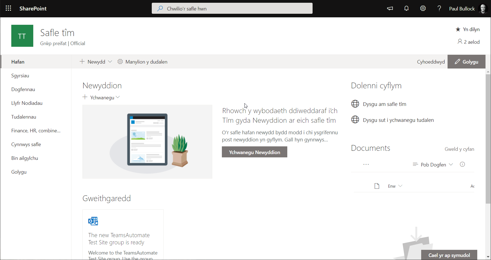

# Testing user preferred language of SharePoint site

## Summary

Are you testing SharePoint multi-lingual features? And want a quick way to switch languages on a site for a particular user or yourself; this can be useful when testing the modern multi-lingual features in SharePoint if you want to check the quality of the pages translated.

This script that changes the MUI setting for a user within the User Information List to update the user with the appropriate language tag.





# [PnP PowerShell](#tab/pnpps)

```powershell

Connect-PnPOnline https://<tenant>.sharepoint.com/sites/<site>
Get-PnPListItem -List "User Information List" -Id 7 # Me

# -OR- #

$userEmail = "paul.bullock@mytenant.co.uk"
$CamlQuery = @"
<View>
    <Query>
        <Where>
            <Eq>
                <FieldRef Name='EMail' />
                <Value Type='Text'>$userEmail</Value>
            </Eq>
        </Where>
    </Query>
</View>
"@

$item = Get-PnPListItem -List "User Information List" -Query $CamlQuery

# Language Reference: https://capacreative.co.uk/resources/reference-sharepoint-online-languages-ids/
$item["MUILanguages"] = "cy-GB" #"en-GB"
$item.Update()
Invoke-PnPQuery

```

***

## Source Credit

Article first appeared on [Testing user preferred language of SharePoint site | CaPa Creative Ltd](https://capacreative.co.uk/2020/05/31/testing-user-preferred-language-of-sharepoint-site-with-pnp-powershell/)

## Contributors

| Author(s) |
|-----------|
| Paul Bullock |

[!INCLUDE [DISCLAIMER](../../docfx/includes/DISCLAIMER.md)]

